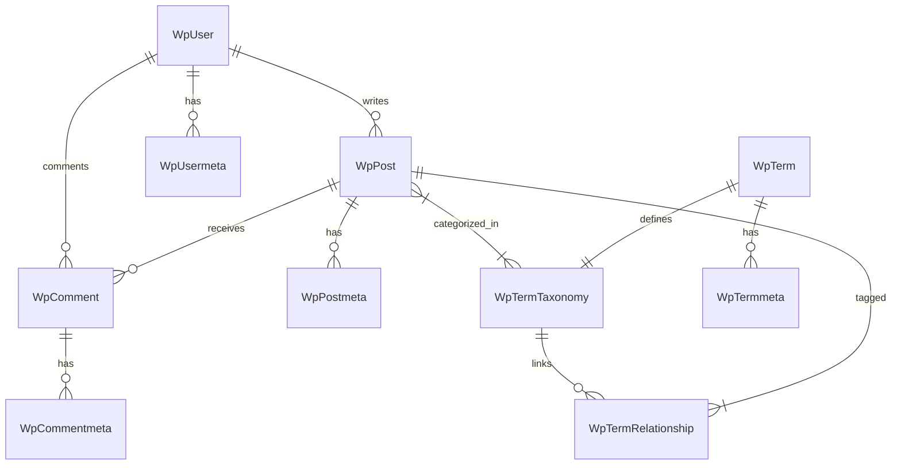

# Phase 2 Documentation: Data Layer & ORM Mapping

## Overview
This document details the implementation of Phase 2, which focused on mapping the WordPress database schema to Rails ActiveRecord models. All core tables have been successfully mapped, preserving relationships and data integrity.

## 1. Model Architecture
All models inherit from `ApplicationRecord` and explicitly define their table names (e.g., `self.table_name = 'wp_posts'`) and primary keys (e.g., `self.primary_key = 'ID'`) to match the legacy WordPress schema.

### Core Models
- **`WpPost`** (`wp_posts`): The central content model.
  - **Key Attributes:** `post_title`, `post_content`, `post_status`, `post_type`.
  - **Scopes:** `published`, `pages`, `posts`, `recent`.
  - **Relationships:** `belongs_to :author`, `has_many :metas`, `has_many :comments`, `has_many :terms`.

- **`WpUser`** (`wp_users`): User management.
  - **Key Attributes:** `user_login`, `user_email`, `user_pass` (Phpass hash).
  - **Relationships:** `has_many :posts`, `has_many :metas`, `has_many :comments`.

- **`WpTerm`** (`wp_terms`): Base taxonomy terms (e.g., "Technology").
  - **Key Attributes:** `name`, `slug`.
  - **Relationships:** `has_one :term_taxonomy`.

- **`WpTermTaxonomy`** (`wp_term_taxonomy`): Defines the type of term (Category vs Tag) and hierarchy.
  - **Key Attributes:** `taxonomy`, `parent`, `count`.
  - **Relationships:** `belongs_to :term`, `has_many :posts`.

- **`WpComment`** (`wp_comments`): User feedback on posts.
  - **Key Attributes:** `comment_content`, `comment_approved`.
  - **Relationships:** `belongs_to :post`, `belongs_to :user`.

- **`WpOption`** (`wp_options`): Global site settings.
  - **Key Methods:** `WpOption.get('siteurl')`.

### Meta Models
Key-Value storage for extending core entities.
- `WpPostmeta` (`post_id`, `meta_key`, `meta_value`)
- `WpUsermeta` (`user_id`, `meta_key`, `meta_value`)
- `WpTermmeta` (`term_id`, `meta_key`, `meta_value`)
- `WpCommentmeta` (`comment_id`, `meta_key`, `meta_value`)

## 2. Entity Relationship Diagram (ERD) Overview

## 3. Verification
A verification script (`bin/verify_models.rb`) was created to ensure all models can interact correctly.
- **Run Verification:** `rails runner bin/verify_models.rb`

## 4. Seeding
A `db/seeds.rb` file was implemented to populate the database with:
- Default Options (Site URL, Blog Name).
- Admin User (with capabilities).
- Default Category ("Uncategorized").
- Sample "Hello World" Post.
- Sample Page.
- Sample Comment.

## 5. Next Steps
- Implement Authentication (Phase 3).
- Build REST API Controllers.
